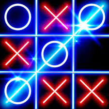

# Tic Tac Toe

<a href= 'https://kelvin-freeman.github.io'>Play now with a friend</a>

This project is a simple game for users to play tic tac toe against the computer.

## Motivation

This project exists as my first attempt in creating an app.
I chose to build this game as an app because it seems to be a 
simple way to express my current knowledge of HTML, CSS and JavaScript.
 

## The Objective and How to Play
Tic Tac Toe is about having fun. In this game the player tries to get three objects in the same row, horizontally, diagonally, or vertically. The first player to get three objects in a row wins the game. When there are no more empty blocks, the user must click the reset button to reset the game.

---

#

### Example 
## 

## Tech Stack
The build of this simple game uses a combination of:

HTML

CSS

Javascript

***Upcoming Features:***

Players will have the ability to create a user account to log in. 
Future versions will keep track of the score between players.

